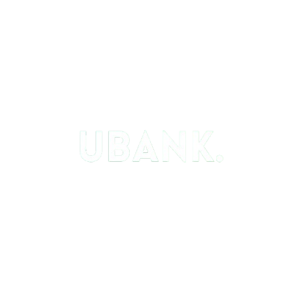

<a name="readme-top">

<br/>

<br />
<div align="center">
  <a href="https://github.com/JerichoNheil05">
  <!-- TODO: If you want to add logo or banner you can add it here -->
    
  </a>
<!-- TODO: Change Title to the name of the title of your Project -->
  <h3 align="center">UBank - Online Banking System</h3>
</div>
<!-- TODO: Make a short description -->
<div align="center">
 UBank is a simple web-based banking system that allows users to perform basic banking operations such as depositing and withdrawing money.
</div>

<br />

<!-- TODO: Change the zyx-0314 into your github username  -->
<!-- TODO: Change the WD-Template-Project into the same name of your folder -->


[](https://wakatime.com/badge/user/018f02fa-26c2-47ca-b9f1-407cf5e4c162/project/31461c44-05b7-461f-9c76-2f069176a0e6)

---

<br />
<br />

<!-- TODO: If you want to add more layers for your readme -->
<details>
  <summary>Table of Contents</summary>
  <ol>
    <li>
      <a href="#overview">Overview</a>
      <ol>
        <li>
          <a href="#key-components">Key Components</a>
        </li>
        <li>
          <a href="#technology">Technology</a>
        </li>
      </ol>
    </li>
    <li>
      <a href="#rule,-practices-and-principles">Rules, Practices and Principles</a>
    </li>
    <li>
      <a href="#resources">Resources</a>
    </li>
  </ol>
</details>

---

## Overview

<!-- TODO: To be changed -->
<!-- The following are just sample -->
Description of the project in details.

Guiding Question:
- What is the project
  Bank is a simple web-based banking system that allows users to perform basic banking operations such as depositing and withdrawing money. The application consists of multiple pages for account management, deposit, withdrawal, and viewing transaction history.
- Whats the purpose
  The purpose of this HTML document is to create a web page for a fictional bank called “UBANK.” The page provides users with information about the bank, allows them to navigate to different sections
- What are key components
  Body Section: Includes an image and promotional content about the bank’s services.
Deposit Section: Contains a form for users to input their account details and perform deposit or withdrawal transactions.
Transaction Section: Displays the user’s balance and provides options to view transaction history.
- What technology used and how it is used
  HTML: The structure of the web page is defined using HTML elements.
CSS: The external stylesheet (style.css) is linked in the <head> section to style the web page, ensuring it looks visually appealing and is responsive.
JavaScript: The script file (script.js) is included at the end of the document to add interactivity, such as handling deposit and withdrawal actions

### Key Components
<!-- TODO: List of Key Components -->
<!-- The following are just sample -->
- Single Page Website
- Transactional

### Technology
<!-- TODO: List of Technology Used -->


## Rules, Practices and Principles
1. Always use `WD-` in the front of the Title of the Project for the Subject followed by your custom naming.
2. Do not rename any .html files; always use `index.html` as the filename.
3. Place Files in their respective folders.
4. All file naming are in camel case.
   - Camel case is naming format where there is no white space in separation of each words, the first word is in all lower case while the succeding words first letter are in upper followed by lower cased letters.
   - ex.: buttonAnimatedStyle.css
5. Use only `External CSS`.
6. Renaming of Pages folder names are a must, and relates to what it is doing or data it holding.
7. File Structure to follow below.

```
WD-ProjectName
└─ assets
|   └─ css
|   |   └─ style.css
|   └─ img
|   |   └─ fileWith.jpeg/.jpg/.webp/.png
|   └─ js
|       └─ script.js
└─ pages
|  └─ pageName
|     └─ assets
|     |  └─ css
|     |  |  └─ style.css
|     |  └─ img
|     |  |  └─ fileWith.jpeg/.jpg/.webp/.png
|     |  └─ js
|     |     └─ script.js
|     └─ index.html
└─ index.html
└─ readme.md
```

## Resources

<!-- TODO: Add References -->
| Title | Purpose | Link |
|-|-|-|
| Bank Project JavaScript | Js integration | https://www.youtube.com/results?search_query=js+banking |
